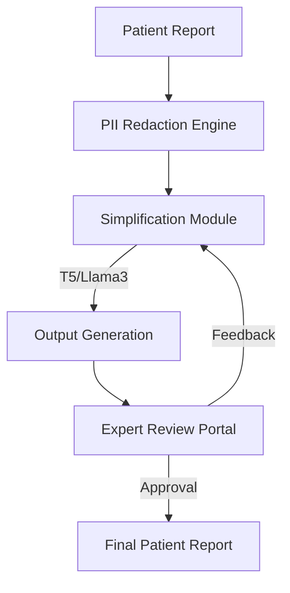

# Doc 2 Me: Medical Jargon Simplification System

Doc 2 Me is an advanced medical jargon simplification system designed to bridge the communication gap between healthcare professionals and patients. It leverages large language models (LLMs) and retrieval-augmented generation (RAG) to transform complex medical reports into easy-to-understand language while maintaining medical accuracy and protecting patient privacy.

## 🚀 Key Features

- **Jargon Simplification**: Automatically converts complex medical terms and diagnostic jargon into patient-friendly language.
- **PII Scrubbing**: Built-in logic to redact Personally Identifiable Information (PII) to ensure HIPAA compliance and data privacy.
- **Expert Review Loop**: Allows medical experts to review, edit, and approve simplified reports, which are then used to further refine the AI models.
- **Multimodal Support**: Processes text, PDF, and DOCX reports, and generates professionally formatted output documents.
- **RAG Integration**: Uses a FAISS-based vector store to provide contextually relevant medical definitions and explanations.

## 🛠️ Technology Stack

- **Frontend**: Flask (Python), HTML5, Vanilla CSS, JavaScript
- **Backend**: Python 3.9+
- **Models**:
  - **Fine-tuned T5**: Specialized for medical text simplification.
  - **Llama 3 (via Ollama)**: Orchestrated with LangChain for complex reasoning and summarization.
- **Vector Database**: FAISS for efficient similarity search.
- **Document Processing**: `python-docx`, `PyPDF2`, `reportlab`.

## ⚙️ Installation & Setup

### Prerequisites
- Python 3.9 or higher
- [Ollama](https://ollama.com/) (for running Llama 3 locally)

### Setup Instructions

1. **Clone the Repository**:
   ```bash
   git clone https://github.com/KushalDevraj/DOC2ME-HEALTH-REPORT-SIMPLIFIER.git
   cd DOC2ME-HEALTH-REPORT-SIMPLIFIER
   ```

2. **Install Dependencies**:
   ```bash
   pip install -r frontend/requirements.txt
   ```

3. **Configure Ollama**:
   Ensure Ollama is running and has the Llama 3 model pulled:
   ```bash
   ollama pull llama3
   ```

4. **Run the Application**:
   Execute the local run script:
   ```bash
   ./run_doc2me_local.sh
   ```
   Access the web interface at `http://localhost:5000`.

## 🏗️ Project Architecture



## 📄 Documentation

Detailed technical reports and validation results are available in the project root:
- `PROJECT_REPORT_FINAL.md`
- `Doc2Me_Exhaustive_Validation_Report.docx`

## 🤝 Credits

Developed as part of the Medical Jargon Simplification project to improve health literacy.